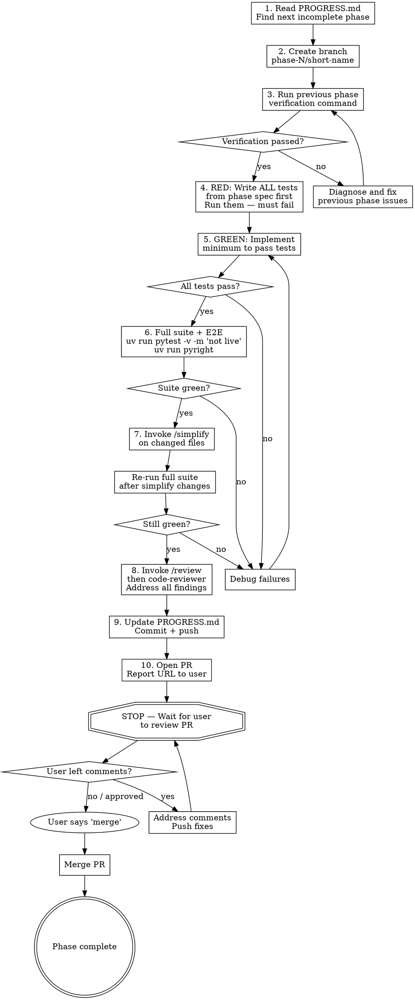

# Nelson Implementation Workflow

Implements Nelson v1 one phase at a time. Reads the plan, creates a branch, writes tests first, implements, reviews, and guides the PR lifecycle with explicit user handoff points.

**Authority documents:**
- `docs/plans/IMPLEMENTATION_PHASES.md` — phase details, TDD test lists, verification commands
- `docs/plans/PROGRESS.md` — tracks which phases are complete

## Lifecycle



## Step-by-Step

### 1. Determine next phase

Read `docs/plans/PROGRESS.md`. Find the first phase with status `not started`.
Read that phase's full section in `docs/plans/IMPLEMENTATION_PHASES.md`.
Read the spec documents listed in the phase's **Session start → Read these docs** section.

**Special case — Phase 1+2:** The plan recommends combining these into one session. If Phase 1 is `not started`, implement both Phase 1 and Phase 2 together on one branch: `phase-1-2/scaffold-contracts`.

### 2. Create branch

```bash
git checkout main && git pull
git checkout -b phase-N/short-description
```

Branch naming: `phase-3/auth-credentials`, `phase-6/happy-path-consensus`, etc.

### 3. Verify previous phase

Run the verification command from the phase's **Session start** section. If it fails, diagnose and fix before starting new work. Do NOT skip verification.

### 4. RED — Write tests first

Write ALL test files and test functions listed in the phase's **TDD approach → Tests to write FIRST** section.

Run them:
```bash
uv run pytest tests/test_<relevant>/ -v
```

They MUST fail. If any test passes before implementation, the test is wrong — it is testing nothing. Fix it.

**End-to-end coverage rule:** Every phase must include at least one test that exercises the full stack built so far. For example:
- Phase 2: schema round-trip through `model_validate` / `model_dump_json`
- Phase 3: auth CLI → dispatcher → events → terminal result
- Phase 6+: full consensus run with fake provider → event stream → RunResult

### 5. GREEN — Implement

Write the minimum implementation to make all tests pass. Do not add behavior that is not tested. Do not add behavior that belongs to a later phase.

Run tests frequently during implementation:
```bash
uv run pytest tests/test_<relevant>/ -v
```

When all phase tests pass, proceed.

### 6. Full suite and E2E check

Run the complete non-live suite and type checker:
```bash
uv run pytest -v -m "not live"
uv run pyright
uv run ruff check .
```

All must pass. If anything breaks, fix it before proceeding.

### 7. Simplify

Invoke the `/simplify` skill on changed code. If the skill is unavailable, skip this step and continue.

After simplify makes changes, re-run the full suite:
```bash
uv run pytest -v -m "not live" && uv run pyright
```

If simplify broke something, fix it.

### 8. Code review

Run review passes in order. If a skill or plugin is unavailable, skip it and continue with the next one.

1. **Invoke the `/review` skill** to get a structured code review of the changed files.
2. **If available**, dispatch the `superpowers:code-reviewer` subagent to review the implementation against the phase requirements and Nelson's engineering standards.

If neither skill is available, perform a self-review: re-read the phase requirements and the changed files, check for boundary violations, typing gaps, and missing tests.

Address all findings from reviews that are worth addressing. For each finding, either fix it or explain why it does not apply. Re-run the full suite after changes.

### 9. Update progress, commit, push, and open PR

1. Update `docs/plans/PROGRESS.md`:
   - Set the phase status to `complete`
   - Set the date
   - Add a verification note (test count, pyright, ruff status)
   - Add a phase notes section with key decisions and implementation details
2. Stage all changed/new files and commit with a descriptive message
3. Push the branch to the remote with `-u`
4. Open a PR against `main` using `gh pr create` with a summary and test plan
5. Report the PR URL to the user

### 10. Handle PR lifecycle

**STOP HERE.** Wait for the user to review the PR.

**When user leaves review comments:**
Address each comment. Push fixes. Tell the user the comments have been addressed. Wait for another review round.

**When user says "merge" (or "okay merge this", "looks good, merge", etc.):**
Merge the PR (or tell the user to merge if you cannot).

## Red Flags — You Are Doing It Wrong

| Sign | Problem |
| --- | --- |
| Writing implementation before tests | TDD violation — write tests first, watch them fail |
| Tests pass before implementation exists | Tests are wrong — they test nothing |
| Skipping verification of previous phase | Building on broken foundation |
| Committing before review passes | Quality gates come before git operations |
| Adding behavior from a later phase | Scope creep — stay in your phase |
| Skipping simplify or code review | Quality gates are not optional |
| Proceeding past a STOP point | Wait for the user |

## Resuming Mid-Phase

If a session is interrupted mid-phase, the incoming agent should:

1. Read `docs/plans/PROGRESS.md` to see current phase is `in_progress`
2. Run `git status` and `git log --oneline -10` to see where work stopped
3. Run the test suite to see what passes and what fails
4. Pick up from wherever the RED-GREEN cycle was interrupted
