# Nelson Flow Diagrams

## Purpose

This document provides visual flow summaries for Nelson v1 using Mermaid diagrams.

These diagrams are explanatory, not normative. If a diagram and a specification diverge, the normative source wins:

- [`../IMPLEMENTATION_PLAN.md`](../IMPLEMENTATION_PLAN.md)
- [`APPLICATION_PROTOCOL.md`](./APPLICATION_PROTOCOL.md)
- [`EVENT_SCHEMA.md`](./EVENT_SCHEMA.md)
- [`RUN_RESULT_SCHEMA.md`](./RUN_RESULT_SCHEMA.md)
- [`CLI_SPEC.md`](./CLI_SPEC.md)
- [`PROMPT_SPEC.md`](./PROMPT_SPEC.md)
- [`ACCEPTANCE_TESTS.md`](./ACCEPTANCE_TESTS.md)

## 1. User Entry Flows

### 1.1 `auth set`

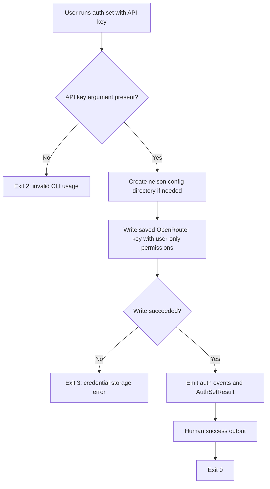

### 1.2 `auth status`

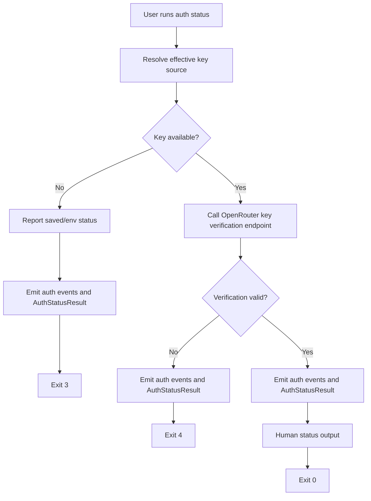

### 1.3 `auth clear`

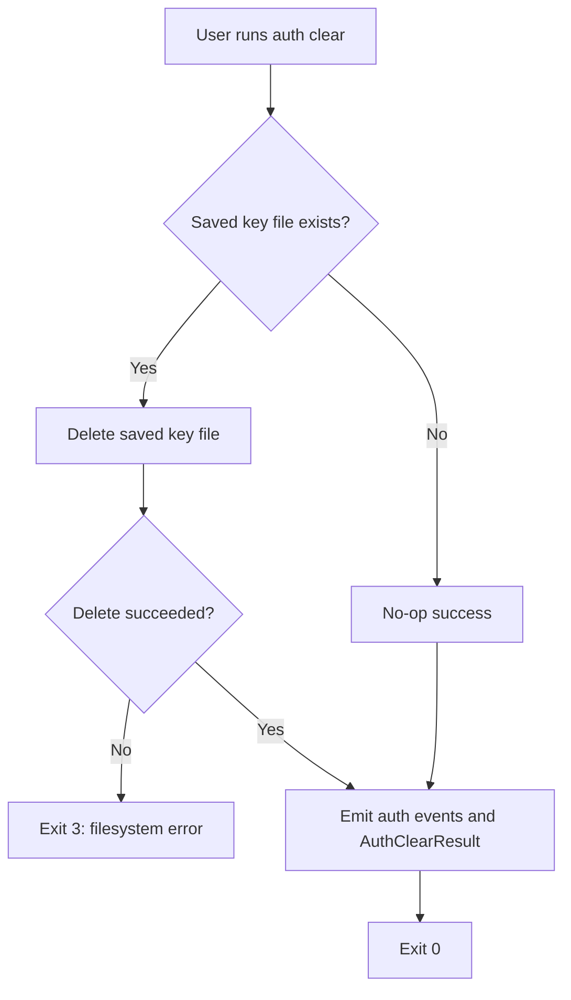

## 2. Run Startup Flows

### 2.1 Input source selection

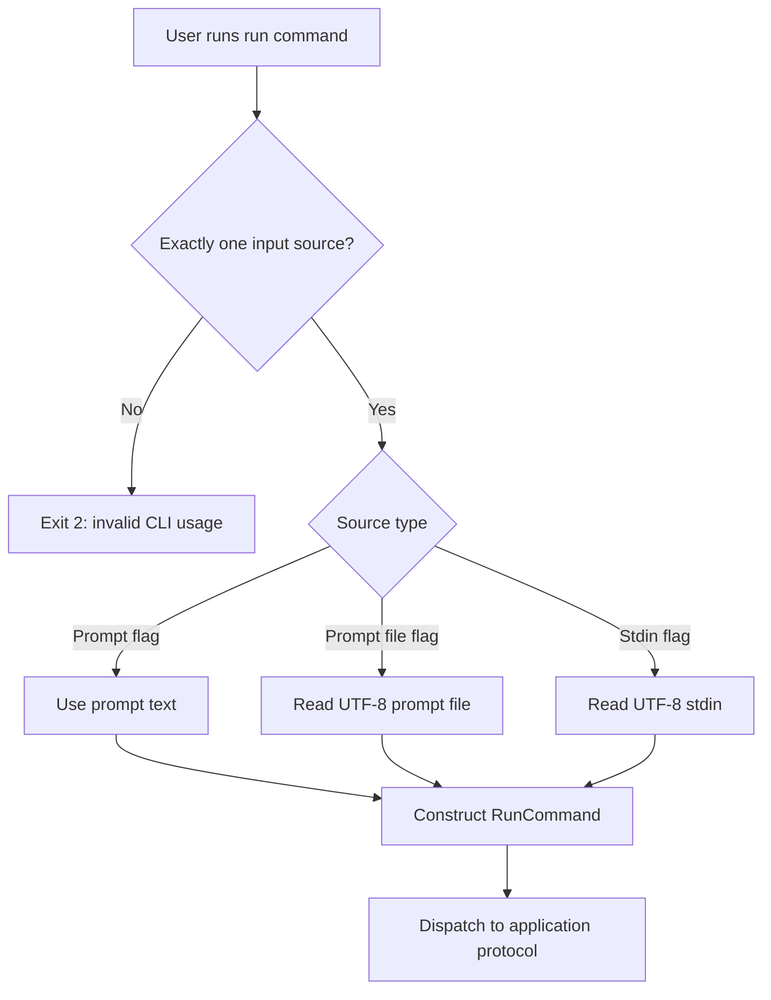

### 2.2 Output mode selection

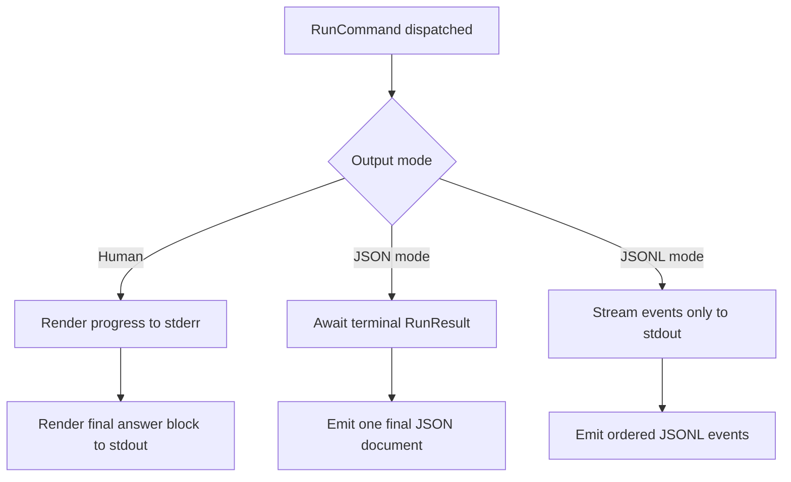

### 2.3 Command-to-core boundary

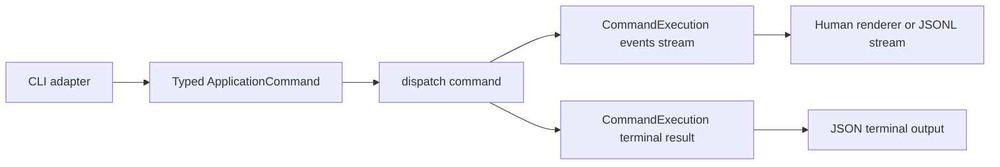

## 3. Happy-Path Orchestration Flow

### 3.1 High-level run lifecycle

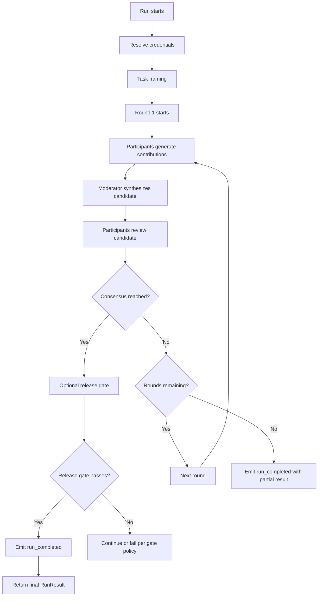

### 3.2 Round lifecycle

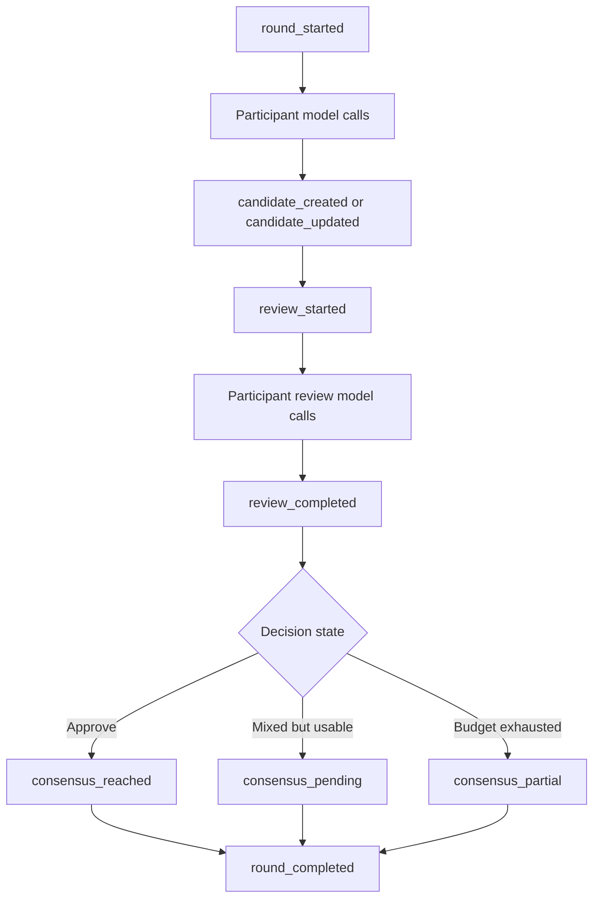

## 4. Reframing Flow

### 4.1 Material framing update inside consensus

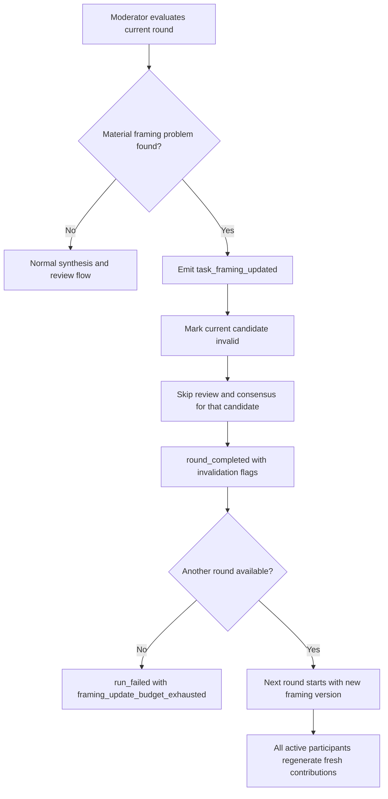

## 5. Failure and Recovery Flows

### 5.1 Structured output failure and repair

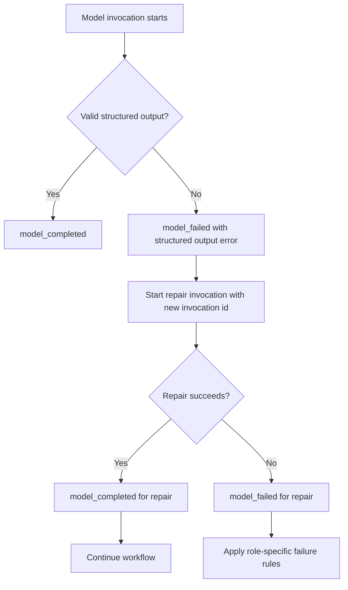

### 5.2 Participant exclusion

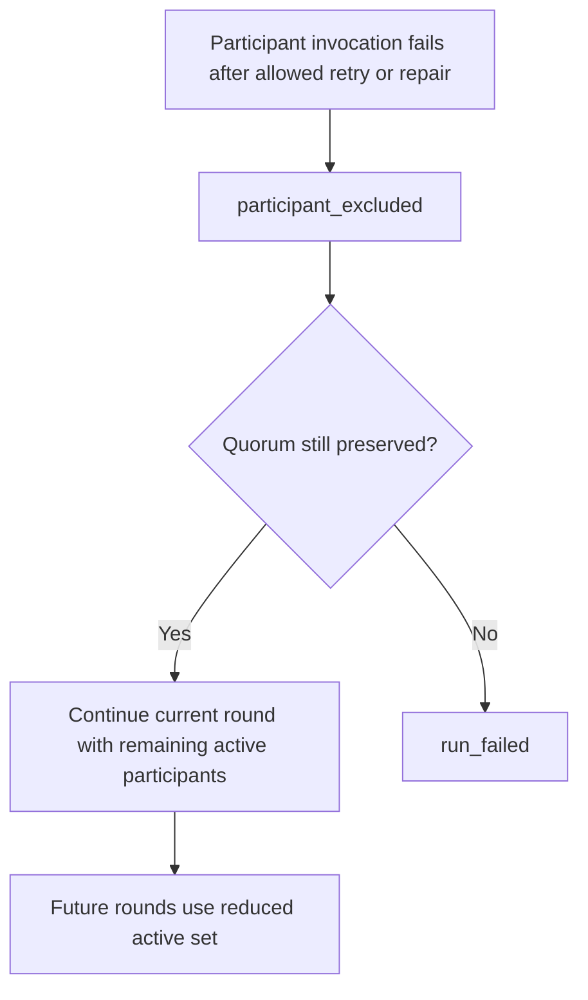

### 5.3 Moderator failure

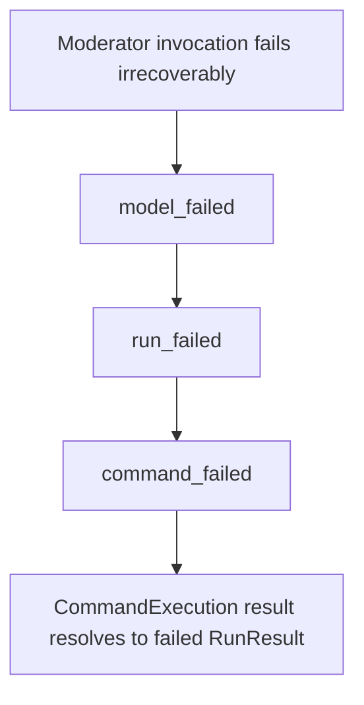

### 5.4 Timeout handling

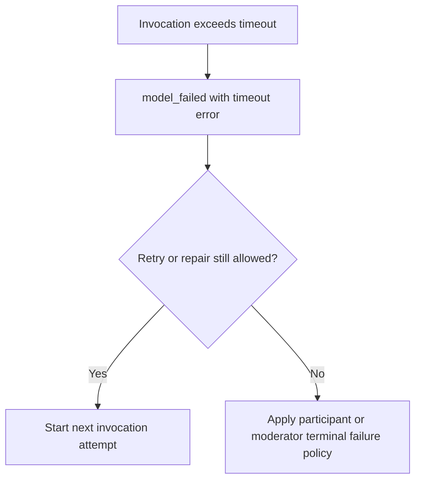

## 6. Final Output Flows

### 6.1 Human mode

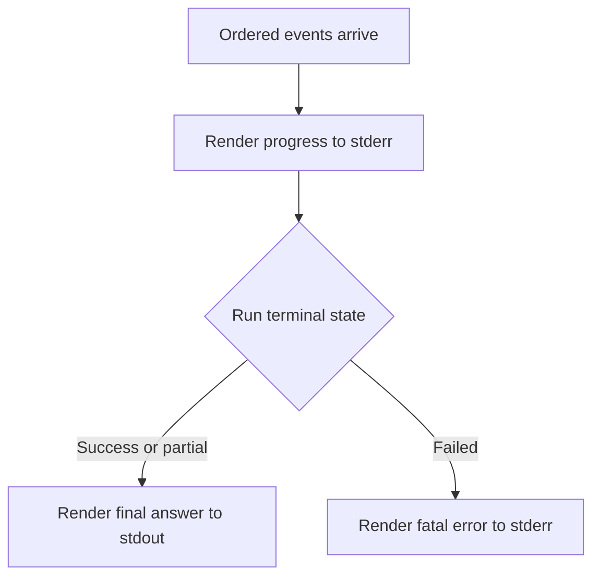

### 6.2 JSON mode

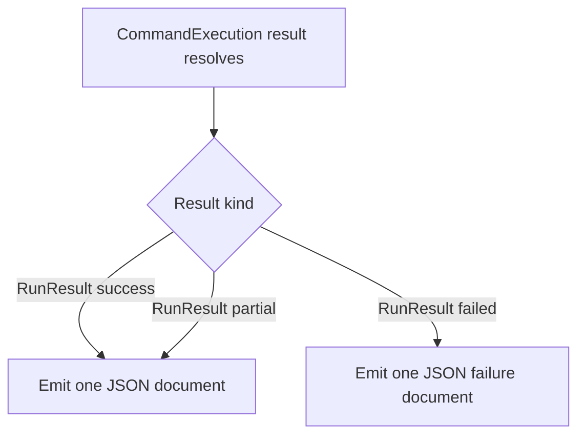

### 6.3 JSONL mode

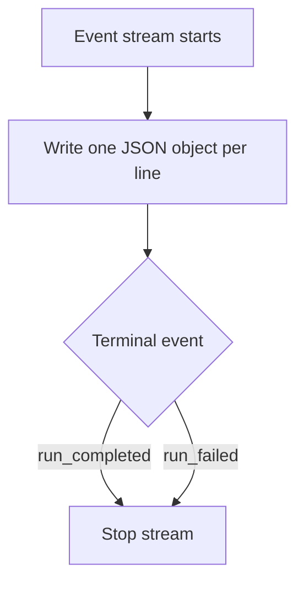
